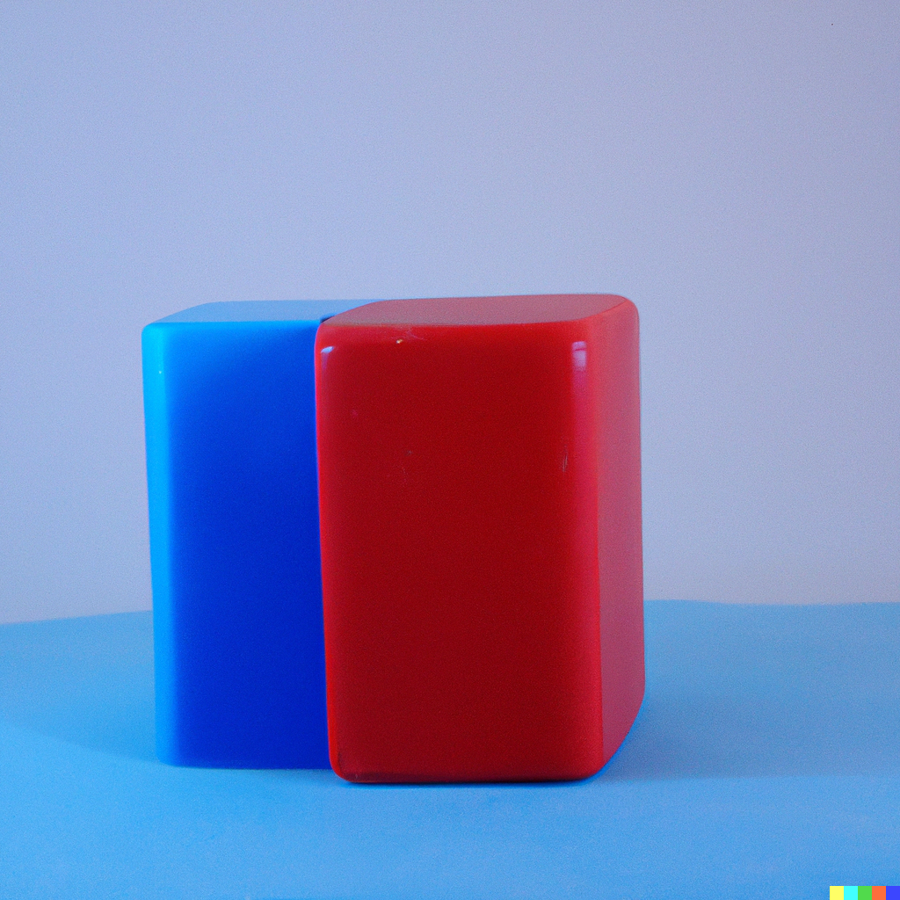
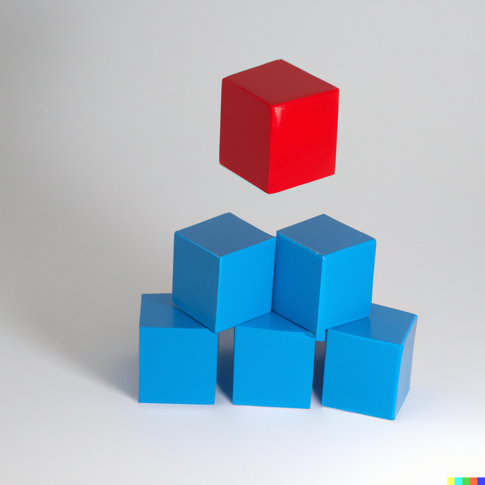
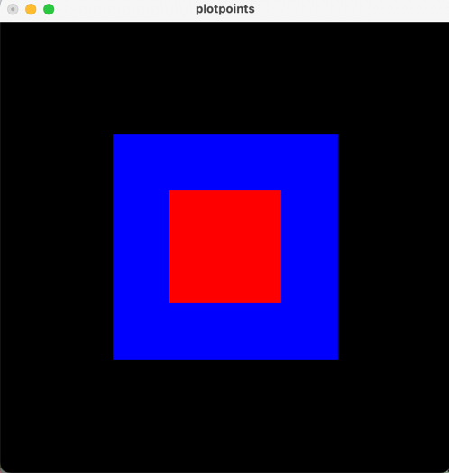
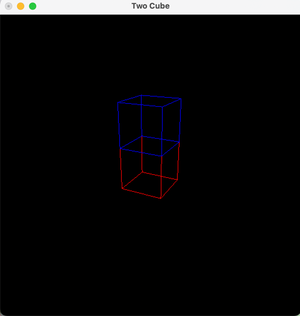

## Prompt: Blue cube on top of red cube 
Dall-E Results

### Codex Results
Codex is unable to understand this prompt, closest result

#### New Prompt: two cube red and blue one on top of another in opengl python

